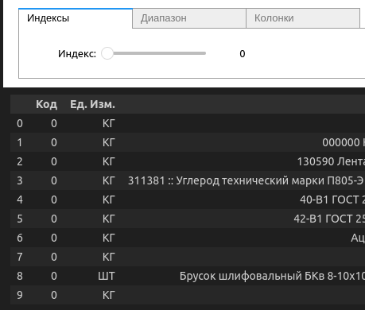

# LookWithJuputer

Данный модуль используется для просмотра таблиц `polars` или `pandas` с помощью виджетов Jupyter.  
Например:  

## Структура

Есть два класса: `DataOut` и `DataShow`. Класс `DataOut` отвечает за управление выводом таблицы. Класс `DataShow` используется для создания верхней надписи и управления событиями.
